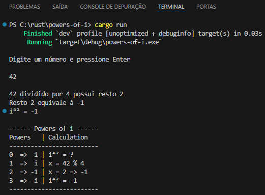
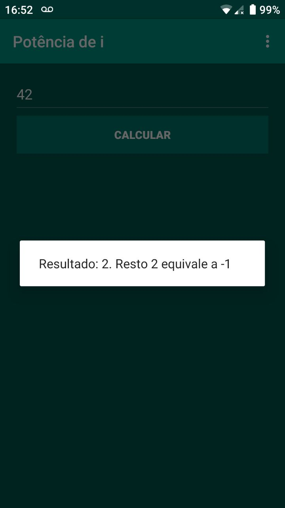

# Potências de i

Desenvolvido inicialmente como aplicativo mobile para Android ( Java ) em 2014, com o objetivo de auxiliar no estudo de Potências de i ( Números complexos ) no último ano do ensino médio

**Requisitos**

* Rust

Abra o terminal, navegue até a pasta do projeto e execute os comandos abaixo

```bash
cargo build
```
```bash
cargo run
```

Para gerar o executável no modo release, use o comando `cargo run --release`

---

*Rust ( terminal )*



*2014 ( mobile )*



